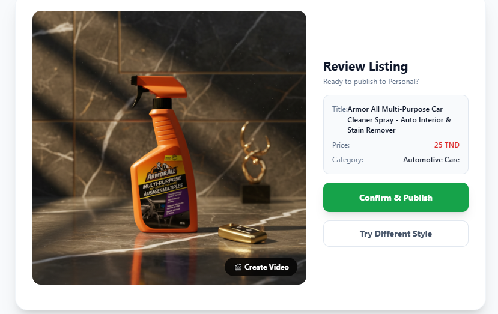

# 🛍️ SouqAI - Tunisia's AI-Powered Marketplace

[](https://ai.google.dev/)
[](https://react.dev/)
[](https://www.typescriptlang.org/)
[](https://vitejs.dev/)

> **Created by Aymen Mabrouk** | © 2025 All Rights Reserved

An innovative e-commerce platform that leverages cutting-edge **Google Generative AI** technologies to revolutionize online shopping in Tunisia. SouqAI combines advanced AI image generation, intelligent product descriptions, and conversational AI assistance to create a seamless marketplace experience.

---

## 📖 Table of Contents

- [Overview](#-overview)
- [Key Features](#-key-features)
- [Technology Stack](#-technology-stack)
- [AI Integration](#-ai-integration)
- [UI/UX Design Philosophy](#-uiux-design-philosophy)
- [Screenshots](#-screenshots)
- [Installation](#-installation)
- [Configuration](#-configuration)
- [Project Structure](#-project-structure)
- [Prompt Engineering](#-prompt-engineering)
- [Performance & Optimization](#-performance--optimization)
- [License](#-license)

---

## 🌟 Overview

**SouqAI** is Tunisia's first AI-native marketplace platform that empowers sellers to create professional product listings with minimal effort. By integrating **Google Gemini 2.5 Flash**, **Gemini 2.5 Flash Image (Nano Banana)**, and **Gemini 3 Pro** models, we've built an ecosystem where artificial intelligence handles the heavy lifting of content creation, image enhancement, and customer support.

### What Makes SouqAI Different?

- 🎨 **AI-Powered Product Photography**: Transform basic product photos into professional studio-quality images
- 📝 **Intelligent Content Generation**: Automatically generate SEO-optimized titles, descriptions, and tags
- 🤖 **Conversational AI Assistant**: "Habibi" - Your shopping companion that speaks Tunisian dialect
- 🎬 **Video Generation**: Create promotional videos from static images
- 🌐 **Multilingual Support**: English, French, and Tunisian Arabic (Derja)

---

## ✨ Key Features

### 🖼️ AI-Enhanced Product Listings
- **Nano Banana Image Generation**: Leverages Gemini 2.5 Flash Image for photorealistic product staging
- **Multiple Style Presets**: Studio, Lifestyle, Outdoor, Luxury backgrounds with narrative prompting
- **Custom Effects**: Add specific vibes like "cinematic lighting", "3D render", "splash effects"
- **Editable Descriptions**: Refine AI-generated content with granular control

### 🧠 Smart Product Intelligence
- **Auto-categorization**: AI analyzes images and suggests appropriate categories
- **SEO Tag Generation**: Creates 5 relevant search tags automatically
- **Description Enhancement**: Improves user input with persuasive, detailed copywriting
- **Multi-language Support**: Content generation in English, French, and Tunisian Derja

### 💬 Habibi AI Chatbot
- **Context-Aware Assistance**: Understands marketplace navigation and product queries
- **Cultural Localization**: Speaks Tunisian dialect with personality
- **Real-time Responses**: Powered by Gemini 3 Pro with 32K thinking budget
- **Streaming Responses**: Progressive text generation for instant feedback

### 🎥 Advanced Media Generation
- **Video Creation**: Veo 3.1 Fast integration for product videos (720p, 16:9)
- **Image-to-Video**: Transform static products into dynamic showcases
- **Optimized Delivery**: Efficient storage via Supabase CDN

---

## 🛠️ Technology Stack

### Frontend Framework
- **React 19.2.0** - Latest React with Concurrent Features
- **TypeScript 5.8.2** - Type-safe development
- **Vite 6.2.0** - Lightning-fast build tool with HMR
- **Tailwind CSS 3.4.17** - Utility-first styling

### AI & Machine Learning
| Technology | Model | Use Case |
|------------|-------|----------|
| **Google Gemini 2.5 Flash** | `gemini-2.5-flash` | Product description refinement, SEO generation |
| **Nano Banana** | `gemini-2.5-flash-image` | Photorealistic image generation & editing |
| **Gemini 3 Pro** | `gemini-3-pro-preview` | Conversational AI chatbot |
| **Veo 3.1** | `veo-3.1-fast-generate-preview` | Product video generation |

### Backend & Storage
- **Supabase** - PostgreSQL database, authentication, and storage
  - `@supabase/supabase-js` (v2) - Client SDK
  - Row-level security (RLS) for data protection
  - Real-time subscriptions for live updates
  
### Development Tools
- **PostCSS** - CSS processing
- **Autoprefixer** - Vendor prefix automation
- **ESLint** - Code quality enforcement
- **Prettier** - Code formatting

### State Management
- **React Hooks** - useState, useEffect, useRef
- **Context API** - Authentication state management
- **Custom Hooks** - Reusable logic encapsulation

### Icons & UI Components
- **Lucide React 0.554.0** - Beautiful icon library
- **Custom Components** - Tailored UI elements

---

## 🤖 AI Integration

### 1. Product Description Enhancement

**Flow:**
```
User Input → Gemini 2.5 Flash → Enhanced Output
```

**Implementation:**
```typescript
export const refineProductDetails = async (
  base64Image: string, 
  currentDraft: ProductDraft, 
  lang: Language
): Promise<ProductDraft> => {
  const ai = new GoogleGenAI({ apiKey: process.env.API_KEY });
  
  const prompt = `
    You are an expert e-commerce copywriter.
    Improve the title, description, generate 5 tags, and confirm category.
    Output in ${lang === 'ar' ? 'Tunisian Arabic' : lang === 'fr' ? 'French' : 'English'}.
  `;
  
  const response = await ai.models.generateContent({
    model: 'gemini-2.5-flash',
    contents: {
      parts: [
        { inlineData: { mimeType: 'image/jpeg', data: base64Image } },
        { text: prompt }
      ]
    },
    config: {
      responseMimeType: 'application/json',
      responseSchema: {
        type: Type.OBJECT,
        properties: {
          title: { type: Type.STRING },
          description: { type: Type.STRING },
          category: { type: Type.STRING },
          tags: { type: Type.ARRAY, items: { type: Type.STRING } }
        }
      }
    }
  });
  
  return refined;
};
```

**Features:**
- ✅ Vision-language model analyzes product images
- ✅ Generates SEO-friendly titles
- ✅ Creates persuasive descriptions
- ✅ Auto-generates 5 relevant search tags
- ✅ Confirms or corrects product category

---

### 2. Nano Banana Image Generation

**Narrative Prompt Engineering:**

Following **Google's official Prompt Engineering Guide for Imagen**, we implemented narrative-based prompts instead of keyword lists for superior results.

**Style Presets:**

```typescript
const stylePresets = {
  'studio': `The product is presented in a high-end professional studio setting. 
             Clean, crisp white infinity background. Soft, even studio lighting 
             to highlight packaging details. High-resolution commercial photography style.`,
             
  'lifestyle': `The product is placed in a realistic, everyday context suitable 
                for its use (e.g., a cozy home, a garage, or a desk). Natural 
                daylighting, shallow depth of field to blur the background slightly. 
                Authentic and relatable atmosphere.`,
                
  'outdoor': `The product is photographed outdoors in a natural environment with 
              sun-drenched lighting. Vivid colors and dynamic shadows. 
              Nature-inspired background.`,
              
  'luxury': `The product is showcased in a premium, elegant setting. Dark, moody 
             lighting with dramatic rim lights. Placed on a polished surface 
             (marble or glass) with a reflection. Sophisticated and expensive aesthetic.`
};
```

**Prompt Construction:**

```typescript
export const constructNanoBananaPrompt = (
  productDesc: string, 
  selectedStyle: string, 
  styleModifier?: string
): string => {
  const baseStyle = stylePresets[selectedStyle];
  const effectsAddition = styleModifier 
    ? ` Add the following specific effects: ${styleModifier}.` 
    : "";
  
  return `Create a photorealistic image of ${productDesc}. 
          ${baseStyle}${effectsAddition} 
          Ensure the product text and branding remains legible and clear.`;
};
```

**Why Narrative Prompts?**

According to **Google's Prompt Engineering Guide**, narrative descriptions produce:
- 🎯 **Better composition** - AI understands scene context
- 💡 **Accurate lighting** - Descriptive lighting phrases work better than keywords
- 🖼️ **Coherent backgrounds** - Story-based prompts create believable environments
- 📏 **Product integrity** - Clear instructions preserve logos and text

---

### 3. Habibi AI Chatbot

**Intelligent Shopping Assistant:**

```typescript
const ai = new GoogleGenAI({ apiKey: process.env.API_KEY });

const instruction = `You are "Habibi", a smart, witty, and helpful AI shopping 
                     assistant for SouqAI (Tunisia). 
                     ${lang === 'ar' 
                       ? 'You MUST speak in Tunisian Dialect (Derja) primarily, mixed with French/English tech terms.' 
                       : 'You mix English with Tunisian words (Aslema, Labes, Barcha).'
                     }
                     Your goal is to help users buy things. Format suggestions with bullet points.`;

const chatSession = ai.chats.create({
  model: 'gemini-3-pro-preview',
  config: {
    systemInstruction: instruction,
    thinkingConfig: { thinkingBudget: 32768 }
  }
});
```

**Capabilities:**
- 🗣️ **Multilingual** - Speaks English, French, and Tunisian Derja
- 🛒 **Product Discovery** - Helps users find items
- 💰 **Price Checking** - Provides pricing information
- 🧭 **Navigation Assistance** - Guides through the app
- ⚡ **Streaming Responses** - Real-time text generation

**How Habibi Navigates the App:**
1. **Context Understanding**: Analyzes user queries about the marketplace
2. **Product Suggestions**: Recommends items based on preferences
3. **Fast Information Retrieval**: Provides instant answers about products, sellers, and prices
4. **Conversational Guidance**: Helps users navigate through different sections naturally

---

### 4. Video Generation (Veo 3.1)

```typescript
export const generateProductVideo = async (base64Image: string): Promise<string> => {
  const veoAi = new GoogleGenAI({ apiKey: process.env.API_KEY });

  let operation = await veoAi.models.generateVideos({
    model: 'veo-3.1-fast-generate-preview',
    image: {
      imageBytes: base64Image,
      mimeType: 'image/png',
    },
    prompt: "Cinematic slow pan of the product, luxury showcase, 4k, highly detailed, commercial style.",
    config: {
      numberOfVideos: 1,
      resolution: '720p',
      aspectRatio: '16:9'
    }
  });

  // Poll for completion
  while (!operation.done) {
    await new Promise(resolve => setTimeout(resolve, 5000));
    operation = await veoAi.operations.getVideosOperation({ operation });
  }

  return videoUrl;
};
```

---

## 🎨 UI/UX Design Philosophy

### Google Stitch Integration

To ensure a **futuristic, cohesive, and user-friendly interface**, we leveraged **Google Stitch** - Google's design system for AI applications - combined with advanced prompt engineering techniques.

**Design Process:**

1. **AI-Assisted Design Generation**
   - Used Google Stitch guidelines as a foundation
   - Applied prompt engineering to Gemini for UI/UX ideation
   - Iterated on color schemes, layouts, and component hierarchies

2. **Prompt Engineering for Design:**
   ```
   "Create a modern e-commerce interface with:
   - Clean white backgrounds with subtle gradients
   - Red accent color (#DC2626) for CTAs and branding
   - Rounded corners (16px-24px) for approachability
   - Neumorphic shadows for depth perception
   - Glassmorphism effects for overlays
   - Generous whitespace for breathing room
   - Mobile-first responsive design"
   ```

3. **Component Design Principles:**
   - **Cards**: Elevated with soft shadows and hover animations
   - **Buttons**: Bold, high-contrast with smooth transitions
   - **Forms**: Focused states with color transitions
   - **Typography**: Inter font family for modern readability
   - **Icons**: Lucide React for consistency

**Result:**
A visually stunning, intuitive interface that feels both modern and familiar, optimized for Tunisian users while maintaining global appeal. The UI/UX was carefully crafted using Google Stitch principles and refined through iterative prompt engineering to achieve the perfect balance between aesthetics and functionality.

---

## 📸 Screenshots

### 1. Dashboard - Product Explorer Feed

*Main marketplace view showcasing AI-generated product listings with professional images*

---

### 2. Seller Studio - Initial Upload

*Clean, intuitive interface for sellers to begin their product listing journey*

---

### 3. Seller Studio - Input Form

*Form interface where sellers provide basic product information before AI enhancement*

---

### 4. Style Your Product Photo

*Advanced styling interface with editable descriptions, style presets, and custom effect modifiers powered by Nano Banana*

---

### 5. Generated Result

*Final AI-enhanced product image with professional studio quality and optimized composition*

---

## 🚀 Installation

### Prerequisites
- **Node.js** 18+ 
- **npm** or **yarn**
- **Google Gemini API Key** ([Get one here](https://aistudio.google.com/app/apikey))
- **Supabase Account** ([Sign up](https://supabase.com))

### Step 1: Clone Repository
```bash
git clone https://github.com/yourusername/souqai.git
cd souqai
```

### Step 2: Install Dependencies
```bash
npm install
```

### Step 3: Configure Environment Variables

Create `.env` file in the project root:

```env
# Google Gemini API Key
GEMINI_API_KEY=your_gemini_api_key_here
```

**Get your keys:**
- **Gemini API**: https://aistudio.google.com/app/apikey
- **Supabase**: Configured in `services/supabaseClient.ts`

### Step 4: Database Setup (Supabase)

Run these SQL commands in Supabase SQL Editor:

```sql
-- Profiles Table
CREATE TABLE profiles (
  id UUID PRIMARY KEY REFERENCES auth.users(id),
  email TEXT UNIQUE NOT NULL,
  name TEXT NOT NULL,
  avatar_url TEXT,
  created_at TIMESTAMP DEFAULT NOW()
);

-- Organizations Table
CREATE TABLE organizations (
  id UUID PRIMARY KEY DEFAULT uuid_generate_v4(),
  owner_id UUID REFERENCES profiles(id),
  name TEXT NOT NULL,
  logo_url TEXT,
  created_at TIMESTAMP DEFAULT NOW()
);

-- Products Table
CREATE TABLE products (
  id UUID PRIMARY KEY DEFAULT uuid_generate_v4(),
  seller_id UUID REFERENCES profiles(id),
  organization_id UUID REFERENCES organizations(id),
  seller_name TEXT NOT NULL,
  title TEXT NOT NULL,
  description TEXT NOT NULL,
  price DECIMAL NOT NULL,
  currency TEXT DEFAULT 'TND',
  category TEXT NOT NULL,
  image_url TEXT NOT NULL,
  video_url TEXT,
  views INTEGER DEFAULT 0,
  created_at TIMESTAMP DEFAULT NOW()
);

-- Enable Row-Level Security
ALTER TABLE profiles ENABLE ROW LEVEL SECURITY;
ALTER TABLE organizations ENABLE ROW LEVEL SECURITY;
ALTER TABLE products ENABLE ROW LEVEL SECURITY;

-- RLS Policies
CREATE POLICY "Public profiles are viewable by everyone"
  ON profiles FOR SELECT USING (true);

CREATE POLICY "Users can update own profile"
  ON profiles FOR UPDATE USING (auth.uid() = id);

CREATE POLICY "Products are viewable by everyone"
  ON products FOR SELECT USING (true);

CREATE POLICY "Sellers can insert own products"
  ON products FOR INSERT WITH CHECK (auth.uid() = seller_id);
```

### Step 5: Storage Bucket Setup

In Supabase → Storage:
1. Create bucket named `media`
2. Make it **public**
3. Allow uploads for authenticated users

### Step 6: Run Development Server

```bash
npm run dev
```

Visit: http://localhost:3000

---

## ⚙️ Configuration

### Vite Configuration

```typescript
// vite.config.ts
export default defineConfig(({ mode }) => {
  const env = loadEnv(mode, '.', '');
  return {
    server: {
      port: 3000,
      host: '0.0.0.0',
    },
    plugins: [react()],
    define: {
      'process.env.API_KEY': JSON.stringify(env.GEMINI_API_KEY),
    },
    resolve: {
      alias: {
        '@': path.resolve(__dirname, '.'),
      }
    }
  };
});
```

### Tailwind Configuration

```javascript
// tailwind.config.js
export default {
  content: [
    "./index.html",
    "./components/**/*.{js,ts,jsx,tsx}",
    "./App.tsx",
    "./index.tsx"
  ],
  darkMode: "class",
  theme: {
    extend: {
      colors: {
        "primary": "#7f0df2",
        "background-light": "#f7f5f8",
        "background-dark": "#191022",
      },
      fontFamily: {
        "display": ["Inter", "sans-serif"]
      },
    },
  },
}
```

---

## 📁 Project Structure

```
SouqAI/
├── components/
│   ├── AuthModal.tsx           # Authentication UI
│   ├── Dashboard.tsx            # Seller dashboard
│   ├── ExplorerFeed.tsx        # Product feed
│   ├── FloatingActionButton.tsx # Chat trigger
│   ├── HabibiChat.tsx          # AI chatbot interface
│   ├── MagicUploader.tsx       # AI product creation wizard
│   ├── Navbar.tsx              # Navigation bar
│   └── ProductCard.tsx         # Product display component
│
├── services/
│   ├── aiMediaService.ts       # Gemini API integrations
│   ├── dbService.ts            # Supabase database operations
│   └── supabaseClient.ts       # Supabase initialization
│
├── images/                     # Screenshots & assets
│   ├── dashboard.png
│   ├── Seller Studio.png
│   ├── Seller Studio with input.png
│   ├── Style Your Product Photo.png
│   └── result.png
│
├── App.tsx                     # Main application component
├── types.ts                    # TypeScript type definitions
├── i18n.ts                     # Internationalization
├── index.tsx                   # Application entry point
├── vite.config.ts              # Vite configuration
└── tailwind.config.js          # Tailwind CSS configuration
```

---

## 🎯 Prompt Engineering

### Best Practices Implemented

Following **Google's Prompt Engineering Guide for Generative AI**:

#### 1. **Be Specific and Descriptive**
❌ Bad: "Make product look good"
✅ Good: "The product is presented in a high-end professional studio setting with soft, even lighting..."

#### 2. **Use Narrative Structure**
❌ Bad: "studio, white background, professional"
✅ Good: "Create a photorealistic image of [product]. The product is showcased in a premium setting..."

#### 3. **Provide Context**
- Include product category
- Describe desired atmosphere
- Specify lighting conditions
- Define background style

#### 4. **Iterative Refinement**
- Base prompt from style preset
- Layer user's custom modifiers
- Preserve brand integrity instructions

#### 5. **Control Output Format**
```typescript
config: {
  responseMimeType: 'application/json',
  responseSchema: {
    type: Type.OBJECT,
    properties: {
      title: { type: Type.STRING },
      description: { type: Type.STRING },
      tags: { type: Type.ARRAY }
    }
  }
}
```

### Nano Banana Specific Techniques

Based on **Google's Imagen Prompt Engineering Guide**:

1. **Subject-Setting-Lighting Pattern**: Always structure prompts with clear subject, setting, and lighting
2. **Descriptive Over Keywords**: Use full sentences instead of comma-separated keywords
3. **Preserve Brand Elements**: Explicitly instruct to maintain product text and logos
4. **Style Consistency**: Use established preset narratives for reproducible results

---

## ⚡ Performance & Optimization

### API Rate Limit Handling

**Exponential Backoff Strategy:**

```typescript
const retryWithBackoff = async <T>(
  fn: () => Promise<T>,
  maxRetries: number = 3,
  baseDelay: number = 1000
): Promise<T> => {
  for (let i = 0; i < maxRetries; i++) {
    try {
      return await fn();
    } catch (error: any) {
      if (error?.status === 429 && i < maxRetries - 1) {
        const delay = baseDelay * Math.pow(2, i);
        await new Promise(resolve => setTimeout(resolve, delay));
        continue;
      }
      throw error;
    }
  }
};
```

**Features:**
- ✅ Automatic retry on rate limit (429)
- ✅ Exponential backoff (1s, 2s, 4s, 8s)
- ✅ User-friendly error messages
- ✅ Graceful degradation

### Image Optimization
- **Format**: JPEG for photos, PNG for graphics
- **Resolution**: Max 2048x2048 pixels
- **Compression**: Base64 encoding for API transmission
- **Storage**: Supabase CDN for fast delivery

### Code Splitting
- **Dynamic imports** for heavy components
- **Lazy loading** for routes
- **Tree shaking** via Vite

---

## 📊 API Usage Guidelines

### Free Tier Limits (Google Gemini)
| Model | Requests/Min | Requests/Day | Tokens/Min |
|-------|--------------|--------------|------------|
| Gemini 2.5 Flash | 15 | 1,500 | 1M |
| Flash Image | 15 | 1,500 | 1M |
| Gemini 3 Pro | 15 | 1,500 | 32K |

### Best Practices
1. **Wait 4-5 seconds** between image generations
2. **Use preset styles** for faster processing
3. **Enable billing** for production use
4. **Monitor quota** at [AI Studio](https://aistudio.google.com)

---

## 🐛 Troubleshooting

See [TROUBLESHOOTING.md](./TROUBLESHOOTING.md) for detailed error resolution guide.

**Common Issues:**
- ❌ **429 Rate Limit**: Wait 60 seconds or enable billing
- ❌ **406 Supabase Error**: Fixed with `.maybeSingle()` method
- ❌ **Missing API Key**: Check `.env` file configuration

---

## 🤝 Contributing

While this is a proprietary project by **Aymen Mabrouk**, feedback and suggestions are welcome.

---

## 📜 License

**© 2025 Aymen Mabrouk. All Rights Reserved.**

This project and its contents are the intellectual property of **Aymen Mabrouk**. 

**Restrictions:**
- ❌ Commercial use prohibited without written permission
- ❌ Distribution or reproduction not allowed
- ❌ Modification for public deployment forbidden
- ✅ Personal study and reference permitted with attribution

For licensing inquiries, please contact the author.

---

## 🙏 Acknowledgments

**Technologies:**
- [Google Gemini AI](https://ai.google.dev/) - Generative AI models
- [Google Stitch](https://stitch.google.com/) - Design system guidance
- [Google Prompt Engineering Guide](https://ai.google.dev/docs/prompt_best_practices) - Prompt optimization
- [Supabase](https://supabase.com/) - Backend infrastructure
- [React Team](https://react.dev/) - Frontend framework
- [Vite Team](https://vitejs.dev/) - Build tooling

**Inspiration:**
- Google's Imagen Prompt Engineering documentation
- Modern e-commerce UX patterns
- Tunisian marketplace culture

---

## 🚀 Future Roadmap

- [ ] **AR Product Visualization** - View products in your space
- [ ] **Voice Search** - Tunisian dialect voice commands
- [ ] **Seller Analytics Dashboard** - Performance metrics
- [ ] **Mobile Apps** - iOS & Android native applications
- [ ] **Payment Integration** - Local payment gateways (Flouci, Konnect)
- [ ] **Advanced Filters** - AI-powered product recommendations
- [ ] **Social Features** - Share listings, follow sellers
- [ ] **Multi-vendor Management** - Organization hierarchy

---

<div align="center">

**Built with ❤️ in Tunisia by Aymen Mabrouk**

*Empowering Tunisian sellers with cutting-edge AI technology*

[⬆ Back to Top](#️-souqai---tunisias-ai-powered-marketplace)

</div>
